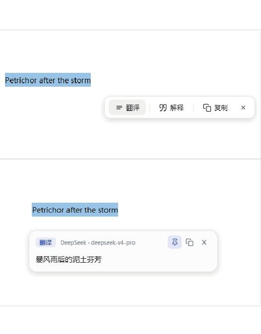
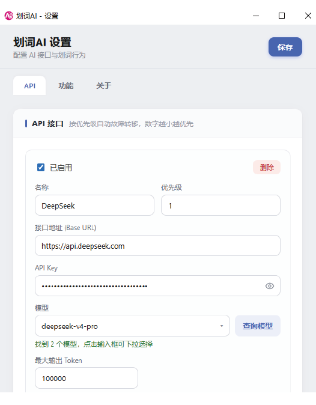
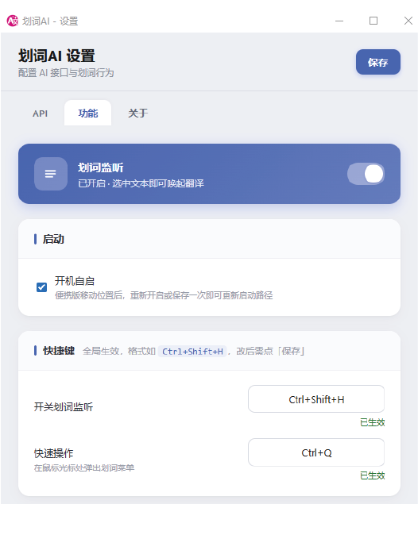
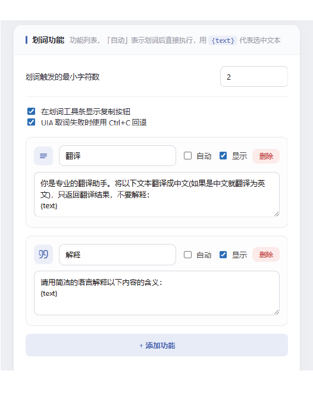

# 划词AI

轻量级 Windows 划词翻译工具。选中文本后自动调用 OpenAI 兼容接口翻译，并在鼠标附近显示结果。

---
## DEMO
<p align="center">
  
  
  
  
</p>

---

## 功能特性

- 划词自动翻译：在任意应用中选中文本后自动触发翻译
- 多接口故障转移：可配置多个 OpenAI 兼容接口，按优先级自动切换
- 可视化设置：通过托盘菜单打开设置界面，无需手动编辑 JSON
- 代理支持：支持 HTTP 代理配置
- 悬浮窗展示：翻译结果以小窗形式显示在鼠标附近
- 剪贴板保护：读取选中文本时会尽量保存并恢复原剪贴板内容
- 便携模式：便携版配置文件与程序放在同一目录，方便备份和迁移

## 下载安装

前往 [GitHub Releases](https://github.com/DsureD/huaci-ai/releases) 下载最新版本。

- `HuaciAI_x.x.x_x64_Portable.zip`：便携版，解压后直接运行 `huaci-ai.exe`
- `huaci-ai_x.x.x_x64_zh-CN.msi` 或 `huaci-ai_x.x.x_x64_en-US.msi`：MSI 安装包
- `huaci-ai_x.x.x_x64-setup.exe`：NSIS 安装程序

推荐使用便携版。便携包只包含主程序、`config.json` 和 `使用说明.txt`，不会额外打包 `启动程序.bat` 或项目 README。

## 快速使用

1. 解压便携版，双击 `huaci-ai.exe` 启动程序。
2. 程序启动后会最小化到系统托盘。
3. 右键托盘图标选择「设置」，或双击托盘图标打开设置界面。
4. 填写 API Key、模型、接口地址、代理等配置并保存。
5. 在任意应用中选中文本，等待 1-2 秒显示翻译结果。

如果使用安装版，首次运行后配置文件位于 `%APPDATA%\huaci-ai\config.json`。便携版配置文件位于程序同目录的 `config.json`。

## 配置说明

优先通过设置界面配置。需要手动编辑时，可参考 `config.example.json`。

常用 API 配置示例：

```json
{
  "api": {
    "timeout_seconds": 30,
    "endpoints": [
      {
        "name": "OpenAI",
        "base_url": "https://api.openai.com/v1",
        "api_key": "sk-你的API密钥",
        "model": "gpt-4o-mini",
        "enabled": true,
        "priority": 1
      },
      {
        "name": "备用接口",
        "base_url": "https://你的备用接口/v1",
        "api_key": "sk-备用密钥",
        "model": "deepseek-chat",
        "enabled": true,
        "priority": 2
      }
    ]
  }
}
```

其他常用配置：

```json
{
  "app": {
    "auto_translate": true,
    "min_text_length": 1,
    "auto_start": false,
    "clipboard_fallback_enabled": true
  },
  "hotkeys": {
    "toggle_capture": "Ctrl+Shift+H",
    "manual_translate": "Ctrl+Q"
  },
  "proxy": {
    "enabled": false,
    "host": "127.0.0.1",
    "port": 7890
  }
}
```

## 托盘菜单

右键托盘图标可以：

- 启用或禁用划词监听
- 打开设置界面
- 退出程序

双击托盘图标可直接打开设置界面。

## 本地开发

环境要求：

- Node.js 20+
- Rust stable
- Windows 10/11

安装依赖：

```bash
npm install
```

开发模式：

```bash
npm run tauri dev
```

构建安装包：

```bash
npm run tauri build
```

构建便携版：

```powershell
.\build-portable.ps1
```

构建产物位于 `src-tauri/target/release/bundle/`。

## GitHub 自动发布

GitHub Actions 只在推送 `v*` tag 时自动构建，不再在每次推送 `main` 或 Pull Request 时构建。

发布新版本：

```bash
git tag v1.0.9
git push origin v1.0.9
```

工作流会自动构建 Windows 版本，并发布 GitHub Release，包含：

- 便携版 ZIP
- MSI 安装包
- NSIS 安装程序

## 技术栈

- 前端：Svelte + TypeScript + Vite
- 桌面框架：Tauri 2
- 后端：Rust
- Windows API：windows-rs
- HTTP 客户端：reqwest

## 常见问题

程序没有反应：

- 检查是否已配置有效 API Key
- 检查划词监听是否处于启用状态
- 检查选中文本长度是否小于配置的最小长度
- 将程序添加到杀毒软件信任列表

程序无法启动：

- 确认系统已安装 WebView2 运行时
- 检查 `config.json` 是否为合法 JSON

翻译失败：

- 检查 API Key、接口地址和模型名称
- 检查网络或代理设置
- 如果配置了多个接口，确认至少一个接口处于启用状态

## 注意事项

- 部分自定义渲染或安全敏感应用可能无法捕获选中文本
- `config.json` 中包含 API Key，请妥善保管

## 许可证

MIT License
